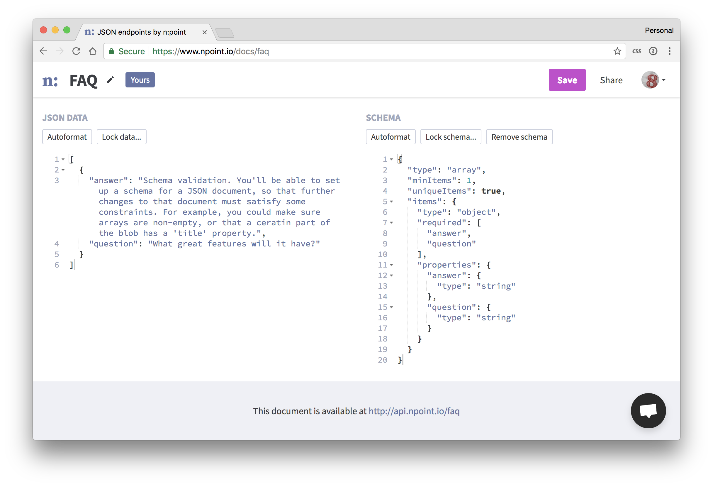

# n:point [](https://circleci.com/gh/azirbel/npoint/tree/master)

[npoint.io](https://www.npoint.io/) is a lightweight data store for your app or prototype.

Save FAQ answers, customer stories, configuration data, or	anything else that
will fit in a JSON blob. Then access your data	directly via API.

Once your app is live, come back later to edit your saved JSON	without having
to redeploy. Or share edit permissions with a	friend so they can help you
experiment! Features like schmema validation and locking mean you can make
these changes confidently, without	breaking your app.



## Contributing

Contributions are welcome!

Please open an issue to discuss proposed changes, rather than opening a pull
request directly.

## Development

#### Setup

```bash
yarn
bundle
```

#### Running locally

```bash
rails s -p 3001
yarn start
```

#### Testing

Setup:

1. Install Chrome
2. Install chromedriver (`brew install chromedriver` on mac)

```bash
rspec
yarn test
```

**Important note**: Rspec integration tests run against the compiled version of the
app in `app/assets`. Build with `npm run build` first, or set up capybara to run against
your live webpack version (I haven't done this yet, but have ideas in `spec_helper.rb`).

## Maintaining

#### Production build

```bash
# 1. Build files
npm run build

# 2. Make an "Add build files" commit
git commit -a -m "Add build files"
```

#### Deploying

```bash

# 1. Set up heroku branches
heroku git:remote -a npoint-io-staging
git remote rename heroku staging

heroku git:remote -a npoint-io
git remote rename heroku production

# 2. Push
git push staging master
git push production master

# 3. Maybe run migrations
heroku run rake db:migrate --app npoint-io-staging
heroku run rake db:migrate --app npoint-io
```

## Similar Tools

* [JSONbin.io](https://jsonbin.io/)
* [Firebase](https://firebase.google.com/)
* [AirTable](https://airtable.com)
* [JSON Schema Validator](https://www.jsonschemavalidator.net/)

## Bookmarks

* [JSON Schema](http://json-schema.org/)
* [JSON in Postgres](https://blog.codeship.com/unleash-the-power-of-storing-json-in-postgres/)

## Codebase TODOs / Wishlist

* Add sentry or similar error collection service (search: `TODO(sentry)`)
* Self-host and use privacy-respecting analytics (search: `TODO(self-host)`)

## Copyright & License

Copyright (c) 2017-2018 Alexander Zirbel - Code released under the [MIT
license](LICENSE).<br/>n:point and the n:point logo are the property of
Alexander Zirbel.
