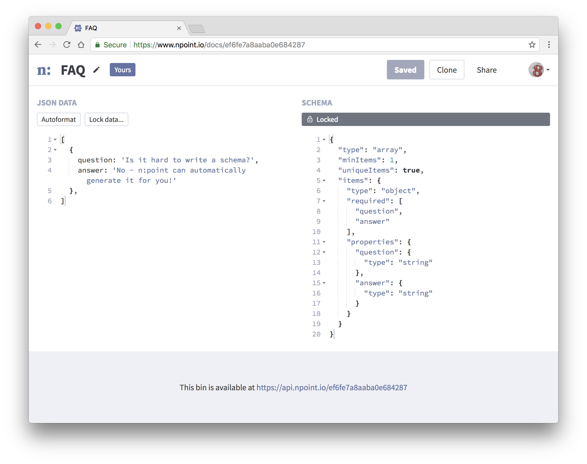

# n:point [](https://circleci.com/gh/azirbel/npoint/tree/master)

[npoint.io](https://www.npoint.io/) is a lightweight data store for your app or prototype.

Save FAQ answers, customer stories, configuration data, or	anything else that
will fit in a JSON blob. Then access your data	directly via API.

Once your app is live, come back later to edit your saved JSON	without having
to redeploy. Or share a login with a	friend so they can help you experiment!
Features like schema validation and locking mean you can make these changes
confidently, without breaking your app.



## Contributing

Contributions are welcome!

Please open an issue to discuss proposed changes, rather than opening a pull
request directly.

## Development

#### Setup

```bash
yarn
bundle
```

#### Running locally

```bash
rails s -p 3001
yarn dev
```

#### Testing

Setup:

1. Install Chrome
2. Install chromedriver (`brew install chromedriver` on mac)

```bash
rspec
yarn test  # no jest tests yet
```

**Important note**: Rspec integration tests run against the compiled version of the
app in `app/assets`. Build with `yarn build` first, or set up capybara to run against
your live webpack version (I haven't done this yet, but have ideas in `spec_helper.rb`).

## Maintaining

#### Production build

```bash
# 1. Build files
yarn build

# 2. Make an "Add build files" commit
git commit -a -m "Add build files"
```

#### Deploying

Push to master. This deploys staging.

Deploy prod manually via render UI.

## Similar Tools

* [JSONbin.io](https://jsonbin.io/)
* [Firebase](https://firebase.google.com/)
* [AirTable](https://airtable.com)
* [JSON Schema Validator](https://www.jsonschemavalidator.net/)

## Bookmarks

* [JSON Schema](http://json-schema.org/)
* [JSON in Postgres](https://blog.codeship.com/unleash-the-power-of-storing-json-in-postgres/)

## Self-hosting

Want to run your own instance of n:point? Go right ahead!

I'd recommend setting it up on [render.com](https://render.com/), which is what
I use for [npoint.io](https://www.npoint.io).

1. Set up a hosted Potsgres DB in render, and make sure `DATABASE_URL` points there
2. Configure environment variables. You'll at least need `HOST` (e.g. `npoint.io`)
3. Use these render settings:

```
# build command
./build.sh

# start command
./start.sh
```

The one piece of the app that won't work is password-reset emails, which go
through a Sendgrid account. I recommend deleting the code for this and handling
it yourself.

## Codebase TODOs / Wishlist

* Add sentry or similar error collection service (search: `TODO(sentry)`)
* Self-host and use privacy-respecting analytics (search: `TODO(self-host)`)
* More testing (search: `TODO(test)`)

## Copyright & License

Copyright (c) 2017-2018 Alexander Zirbel - Code released under the [MIT
license](LICENSE).<br/>n:point and the n:point logo are the property of
Alexander Zirbel.
